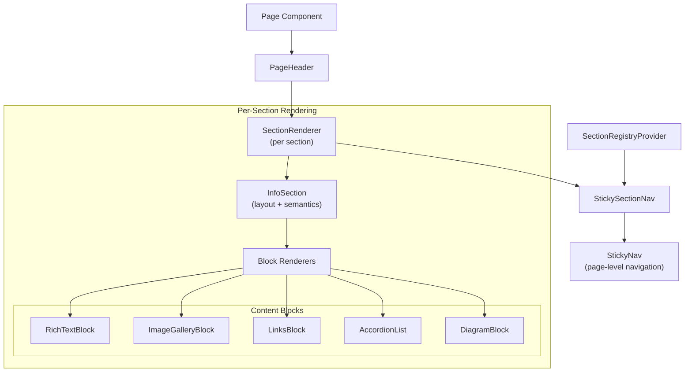

# Architecture Overview

This document provides a high-level, implementation-agnostic overview of the application architecture. It is intended to help maintainers, reviewers, and future contributors quickly understand **how the system is structured**, **how data and control flow through it**, and **where responsibilities are intentionally divided**.

The goal is clarity of _design intent_, not line-by-line documentation.

---

## 1. Architectural Philosophy

The application is built around a few core principles:

- **Declarative composition over imperative wiring**
- **Data-driven pages** rather than hard-coded layouts
- **Strict separation of concerns** between:
  - Navigation
  - Layout
  - Content rendering
  - Interaction state
- **Predictable testability** through shared contracts and factories

At a high level:

> **Pages do not render content directly.**  
> They _declare configuration_, and shared renderers orchestrate the UI.

---

## 2. High-Level System Diagram (Conceptual)

This structure ensures that:

- Layout logic is centralized
- Navigation logic is global and stateful
- Content is modular and replaceable

---

## 3. Pages: Declarative Entry Points

**Location:** `src/pages/*`

Pages are intentionally thin. Their responsibilities are limited to:

- Importing section configuration data
- Declaring the active page route
- Rendering shared structural components

### What Pages Do

- Render `PageHeader`
- Invoke `SectionRenderer` for each section
- Mount `StickyNav` and `StickySectionNav`

### What Pages Do _Not_ Do

- They do **not** render blocks directly
- They do **not** manage scroll state
- They do **not** contain navigation logic

This design enables:

- Uniform page behavior
- Shared testing via `createPageTests`
- Easy addition of new pages with minimal code

---

## 4. Sections: Layout + Registration

### 4.1 InfoSection

**Role:** Semantic + visual wrapper for a page section

Responsibilities:

- Provides a semantic `<section>` boundary
- Renders section headers (title, subtitle, icon)
- Hosts section content

It is **layout-only** and contains no navigation logic.

---

### 4.2 SectionRenderer

**Role:** Orchestrator

SectionRenderer is one of the most important architectural components.

Responsibilities:

- Registers/unregisters sections with the `SectionRegistryProvider`
- Delegates layout to `InfoSection`
- Dispatches block data to the correct block renderer
- Handles unknown/corrupt block types defensively

Key design decision:

> **SectionRenderer does not care how blocks render — only _which_ renderer handles them.**

This keeps block logic isolated and testable.

---

## 5. Blocks: Content Units

**Location:** `src/components/blocks/*`

Blocks are **pure content renderers**. Each block:

- Accepts validated, typed data
- Renders a specific content pattern
- Contains no navigation or page-level logic

Examples:

- `RichTextBlock`
- `ImageGalleryBlock`
- `LinksBlock`
- `AccordionList`
- `MermaidDiagram`

Blocks are:

- Composable
- Independently testable
- Replaceable without affecting page structure

---

## 6. Navigation Architecture

### 6.1 StickyNav (Page-Level Navigation)

**Role:** Global page navigation

Responsibilities:

- Displays links to top-level pages
- Highlights the active route
- Hosts the theme toggle
- Handles mobile/desktop navigation variants

StickyNav is **route-aware**, but not section-aware.

---

### 6.2 StickySectionNav (Intra-Page Navigation)

**Role:** Section-level navigation

Responsibilities:

- Displays links for visible page sections
- Highlights the active section
- Updates URL hash on interaction
- Coordinates programmatic scrolling

StickySectionNav does **not** discover sections itself.

Instead, it consumes state from the section registry.

---

## 7. SectionRegistryProvider: The Glue

**Location:** `src/navigation/SectionRegistryProvider`

This provider is the backbone of section-based navigation.

Responsibilities:

- Maintains an ordered registry of page sections
- Prevents duplicate section IDs
- Enables StickySectionNav to render dynamically

Key insight:

> **Sections self-register at render time.**

This eliminates:

- Manual nav configuration
- Order mismatches
- Hardcoded section lists

---

## 8. Scroll & History Coordination

### useScrollSpyWithHistory

**Role:** Synchronize scroll position, active section state, and URL hash

Responsibilities:

- Detects which section is currently active
- Differentiates user scroll vs programmatic scroll
- Prevents scroll feedback loops

This hook is intentionally isolated so:

- Navigation remains declarative
- Scroll logic is testable
- Side effects are contained

---

## 9. Testing Architecture (Brief)

The testing strategy mirrors the architecture:

- **Component tests** verify behavior, not structure
- **Page tests** are declarative via `createPageTests`
- **Navigation utilities** are tested at contract boundaries

Key philosophy:

> Tests describe _what must always be true_, not _how it is implemented_.

---

## 10. Why This Architecture Works Well

This design provides:

- **Scalability** – new pages and sections are cheap
- **Consistency** – shared contracts prevent drift
- **Testability** – orchestration and rendering are isolated
- **Maintainability** – changes have limited blast radius

It also communicates intent clearly to reviewers — which is especially valuable for a portfolio project.

---

## 11. How to Extend the System

To add a new page:

1. Create section data
2. Create a page component
3. Bind it via `createPageTests`

To add a new block type:

1. Create a block renderer
2. Add a block factory (if needed)
3. Register it in `SectionRenderer`

No navigation updates required.

---

## 12. Final Note

This architecture is intentionally opinionated.

It prioritizes:

- Predictability over flexibility
- Clarity over cleverness
- Contracts over convenience

Those tradeoffs are deliberate — and documented.
