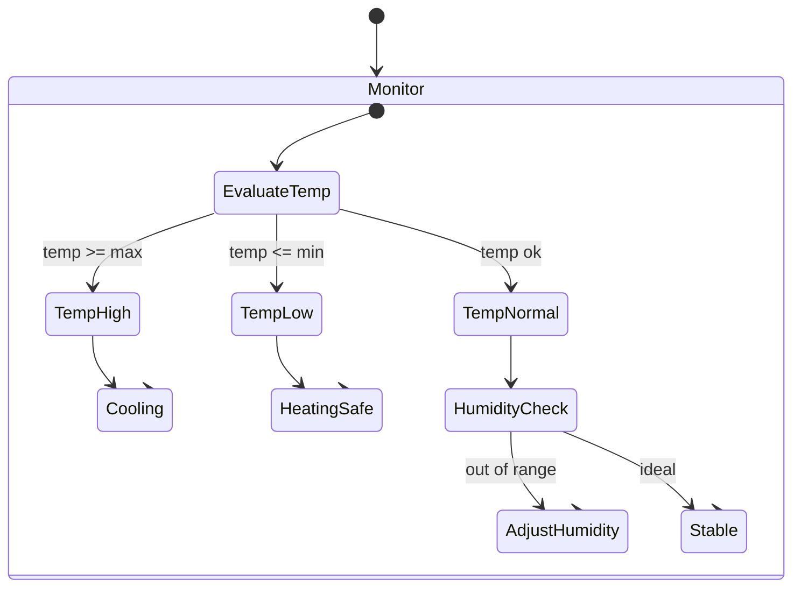

# Diagram Visual Style Guide

## Supported diagram types

Use only these **(stable + tolerant + exporter-friendly)**:

- flowchart (or flowchart TD/LR)
- sequenceDiagram
- classDiagram
- erDiagram
- stateDiagram
- stateDiagram-v2

Do not use: mindmap, experimental types, or indentation-sensitive grammars.

Diagram structure rules

- Init block is mandatory and must be first
- Blank line after declaration is mandatory
- Prefer 2-space indentation consistently
- No tabs
- Keep labels short (aim: ≤ 28 chars per node label)
- Prefer IDs + display labels for nodes:
- Avoid punctuation in IDs; keep IDs PascalCase or camelCase.
- Layout rules for flowcharts
- Use one primary direction per diagram:

Architecture/concepts: `flowchart TD`

Pipelines/steps: flowchart LR

Keep the first screen view readable:

Group with a “hub node” pattern:

Controller --> Inputs/Outputs/Logic/Storage

Avoid deep nesting more than 3 levels.

Styling rules for consistency

Use one theme system (your Mermaid init).

Disable HTML labels (already good in your config).

Avoid custom per-diagram styling except when absolutely needed.

Recommended baseline init block (portable + stable):

```mermaid
%%{init: {
  "theme": "base",
  "themeVariables": {
    "fontFamily": "Inter, sans-serif",
    "fontSize": "16px",
    "lineColor": "#64748b",
    "primaryColor": "#1e293b",
    "primaryTextColor": "#f8fafc",
    "primaryBorderColor": "#c9a227",
    "secondaryColor": "#334155",
    "secondaryTextColor": "#f8fafc"
  },
  "flowchart": { "curve": "linear" }
}}%%
```

Flowchart node conventions

Actors / externals: rounded nodes
User((User))

Systems: rectangles
`Client[Client]`

Stores: cylinders
`DB[(Database)]`

Cloud storage: labeled store
`S3[(S3 Bucket)]`11

Example “concept map” flowchart template (mindmap replacement):



### Sequence diagram conventions

- Participants: User, Client, API, DB, S3
- Use Note over sparingly for intent.
- Avoid overly long participant names (PNG truncation risk).

### ER diagram conventions

- Prefer minimal fields (only the ones that communicate the model).
- Use consistent entity naming (SINGULAR nouns).
- Avoid huge ERDs—split into bounded contexts if needed.
