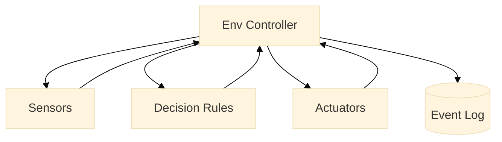

# Diagram Visual Style Guide

## Supported Diagram Types

Use only these **(stable + tolerant + exporter-friendly)**:

- flowchart (or flowchart TD/LR)
- sequenceDiagram
- classDiagram
- erDiagram
- stateDiagram
- stateDiagram-v2

Do not use mindmaps, experimental diagram types, or indentation-sensitive grammars.

## Diagram Structure Rules

- Init block is mandatory and must be first
- Blank line after declaration is mandatory
- Prefer 2-space indentation consistently
- No tabs
- Keep labels short (aim: ≤ 28 chars per node label)
- Prefer IDs + display labels for nodes
- Avoid punctuation in IDs; keep IDs PascalCase or camelCase.

## Layout Rules for Flowcharts

- Use one primary direction per diagram
- Architecture/concepts: `flowchart TD`
- Pipelines/steps: `flowchart LR`

Keep the first viewport readable:

Use a "hub node" pattern:

`Controller --> Inputs/Outputs/Logic/Storage`

Avoid nesting deeper than 3 levels.

## Styling Rules for Consistency

Use one theme system (the baseline init block below).

Disable HTML labels (already disabled in your config).

Avoid custom per-diagram styling except when absolutely needed.

Recommended baseline init block (portable + stable):

```mermaid
%%{init: {
  "theme": "base",
  "themeVariables": {
    "fontFamily": "Inter, sans-serif",
    "fontSize": "16px",
    "lineColor": "#64748b",
    "primaryColor": "#1e293b",
    "primaryTextColor": "#f8fafc",
    "primaryBorderColor": "#c9a227",
    "secondaryColor": "#334155",
    "secondaryTextColor": "#f8fafc"
  },
  "flowchart": { "curve": "linear" }
}}%%
```

## Flowchart Node Conventions

- Actors / externals (rounded nodes): `User((User))`
- Systems (rectangles): `Client[Client]`
- Stores (cylinders): `DB[(Database)]`
- Cloud storage (labeled store): `S3[(S3 Bucket)]`

Example “concept map” flowchart template (mindmap replacement):



## Sequence Diagram Conventions

- Participants: User, Client, API, DB, S3
- Use Note over sparingly to clarify intent.
- Avoid overly long participant names (PNG truncation risk).

## ER Diagram Conventions

- Prefer minimal fields (only the ones that communicate the model).
- Use consistent entity naming (SINGULAR nouns).
- Avoid huge ERDs—split into bounded contexts if needed.

## Deferred Diagram Rendering Config

When diagrams are rendered through `SectionRenderer`, you can defer Mermaid mounts
to reduce initial page work.

- Enable with `deferDiagrams: true` for defaults, or provide an object for fine control.
- `threshold` accepts either:
  - a single number in `[0, 1]`
  - a non-empty `number[]` where every value is in `[0, 1]`
- Valid `number[]` thresholds are normalized to sorted, unique values before observer use.
- Invalid `threshold` values fall back to `0.01`.
- `rootMargin` string values are trimmed before observer use.
- `placeholderMinHeight` string values are trimmed before placeholder rendering.
- `loadingLabel` string values are trimmed before assigning the deferred placeholder status label.
- `loadingCaption` string values are trimmed before rendering the visible deferred placeholder caption.
- `loadingLive` accepts `"polite"`, `"assertive"`, or `"off"` (case-insensitive, trimmed); invalid or non-string values fall back to `"polite"`.
- If any `deferDiagrams` config getter throws at runtime, affected values fall back to defaults and rendering continues safely.
- Deferred placeholders render with `role="status"` for `"polite"` and `"assertive"`; when `loadingLive` is `"off"`, `role="status"` is omitted and `aria-live="off"` is preserved.
- Deferred placeholders expose `aria-describedby` only in live-region modes; when `loadingLive` is `"off"`, `aria-describedby` is omitted.
- Deferred placeholders expose `aria-label` from `loadingLabel` only in live-region modes; when `loadingLive` is `"off"`, `aria-label` is omitted.
- If `IntersectionObserver` is unavailable in the environment, deferred mounts fall back to eager rendering immediately.
- If observer construction fails at runtime, deferred mounts fall back to eager rendering.
- If `observe()` throws at runtime, deferred mounts also fall back to eager rendering.
- The observer is disconnected automatically when the host element unmounts before intersection fires.
- Deferred mounts trigger when entries are intersecting or have a positive `intersectionRatio`.
- Observer callbacks where no entry has `isIntersecting: true` or a positive `intersectionRatio` are silently ignored; the deferred placeholder remains until a qualifying intersection occurs.
- `fallbackDelayMs`: a finite non-negative number sets a timer that mounts the diagram after the delay elapses; values above 15 000 ms are clamped to that maximum. The timer is cancelled automatically on unmount to prevent stale state updates.
- `startAt`: a non-negative integer index; diagrams before that position in the section render eagerly regardless of other defer settings.
- `maxDeferred`: a non-negative integer cap; once that many diagrams have been deferred in the section, remaining diagrams render eagerly.
- `filter`: an optional `(block, context) => boolean` callback; returning `false` renders the diagram eagerly. `context.deferConfig` includes the effective defer settings (`rootMargin`, `threshold`, `placeholderMinHeight`, `loadingLabel`, `loadingCaption`, `loadingLive`, `fallbackDelayMs`, `startAt`, `maxDeferred`). Filter exceptions default to deferring the block.
- Set `enabled: false` in the config object to explicitly disable deferral while keeping the rest of the config intact.
- Page-level defer resolvers should return fresh config objects per section to avoid cross-section mutation coupling.

Example:

```js
deferDiagrams: {
  enabled: true,
  rootMargin: "640px 0px",
  threshold: [0, 0.5, 1],
  placeholderMinHeight: "240px",
  loadingLabel: "Diagram pending",
  loadingCaption: "Preparing chart",
  loadingLive: "off",
}
```
